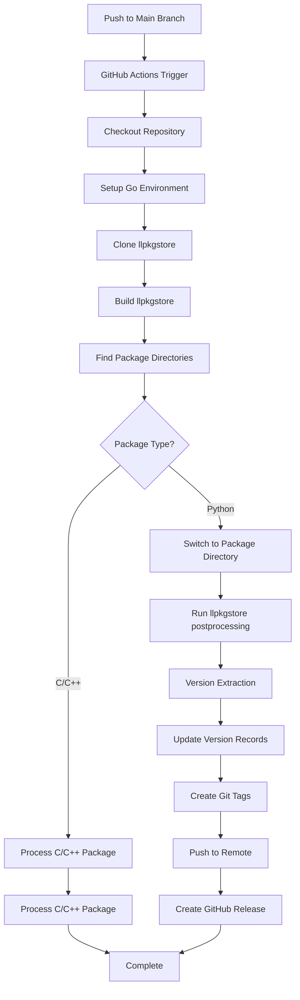

# CI/CD Workflow Documentation

This document provides comprehensive information about the CI/CD workflow in llpkgstore, including the postprocessing pipeline, GitHub Actions integration, and troubleshooting.

## 🎯 Overview

The llpkgstore CI/CD workflow provides automated package processing, version management, and release creation. The workflow is designed to handle both C/C++ and Python packages with unified version management.

## 🔄 Workflow Architecture



## 📋 Workflow Configuration

### GitHub Actions Workflow

**File**: `.github/workflows/postprocessing.yml`

```yaml
name: post-processing
on:
  push:
    branches: [main]
  pull_request:
    types: [closed]
    branches: [main]

jobs:
  post-processing:
    runs-on: ubuntu-latest
    if: github.event.pull_request.merged == true || github.event_name == 'push'
    
    steps:
      - name: Checkout main branch
        uses: actions/checkout@v4
        with:
          ref: main
          path: .main
          repository: ${{ github.repository }}
          token: ${{ secrets.GITHUB_TOKEN }}
          persist-credentials: true
          clean: true
          sparse-checkout-cone-mode: true
          fetch-depth: 1
          fetch-tags: false
          show-progress: true
          lfs: false
          submodules: false
          set-safe-directory: true

      - name: Setup Go
        uses: actions/setup-go@v4
        with:
          go-version: 1.24.x
          check-latest: false
          token: ${{ secrets.GITHUB_TOKEN }}
          cache: true

      - name: Install GitHub CLI
        run: |
          type -p curl >/dev/null || (sudo apt update && sudo apt install curl -y)
          curl -fsSL https://cli.github.com/packages/githubcli-archive-keyring.gpg | sudo dd of=/usr/share/keyrings/githubcli-archive-keyring.gpg \
          && sudo chmod go+r /usr/share/keyrings/githubcli-archive-keyring.gpg \
          && echo "deb [arch=$(dpkg --print-architecture) signed-by=/usr/share/keyrings/githubcli-archive-keyring.gpg] https://cli.github.com/packages stable main" | sudo tee /etc/apt/sources.list.d/github-cli.list > /dev/null \
          && sudo apt update \
          && sudo apt install gh -y

      - name: Authenticate with GitHub
        run: |
          echo "${{ secrets.GITHUB_TOKEN }}" | gh auth login --with-token
          gh auth status

      - name: Clone and build llpkgstore
        run: |
          git clone https://github.com/PengPengPeng717/llpkgstore.git
          cd llpkgstore
          git checkout 95_modify
          go build -o llpkgstore ./cmd/llpkgstore
          sudo mv llpkgstore /usr/local/bin/

      - name: Process packages
        run: |
          echo "Current branch: $(git branch --show-current)"
          echo "Current commit: $(git log -1 --pretty=format:%s)"
          
          # Extract source branch from commit message
          COMMIT_MSG=$(git log -1 --pretty=format:%s)
          if [[ $COMMIT_MSG =~ Merge\ pull\ request.*from\ PengPengPeng717/([^[:space:]]+) ]]; then
            SOURCE_BRANCH="${BASH_REMATCH[1]}"
            echo "Detected source branch from commit message: $SOURCE_BRANCH"
            
            # Switch to source branch
            echo "Switching to source branch: $SOURCE_BRANCH"
            git fetch origin $SOURCE_BRANCH:$SOURCE_BRANCH
            git checkout $SOURCE_BRANCH
            echo "Switched to branch: $(git branch --show-current)"
          else
            echo "Could not detect source branch from commit message: $COMMIT_MSG"
          fi
          
          echo "Final branch: $(git branch --show-current)"
          echo "Final commit: $(git log -1 --pretty=format:%s)"
          
          # Debug information
          echo "=== Debug Information ==="
          echo "Current working directory: $(pwd)"
          echo "Directory contents:"
          ls -la
          echo "Tabulate directory contents:"
          ls -la tabulate/ || echo "Tabulate directory not found"
          echo "Looking for llpkg.cfg files:"
          find . -name "llpkg.cfg" -type f
          echo "=== End Debug ==="
          
          # Process packages
          for dir in */; do
            if [ -d "$dir" ] && [ -f "$dir/llpkg.cfg" ]; then
              echo "Processing package in directory: $dir"
              if grep -q '"type": "python"' "$dir/llpkg.cfg"; then
                echo "Found Python package: $dir"
                echo "=== Before llpkgstore postprocessing ==="
                echo "Current directory: $(pwd)"
                echo "Directory contents:"
                ls -la
                echo "Switching to package directory: $dir"
                cd "$dir"
                echo "New working directory: $(pwd)"
                echo "Directory contents:"
                ls -la
                echo "About to run: llpkgstore postprocessing from package directory"
                echo "=== End Before ==="
                llpkgstore postprocessing
                echo "=== After llpkgstore postprocessing ==="
                echo "Current directory: $(pwd)"
                echo "Directory contents:"
                ls -la
                echo "=== End After ==="
                cd ..
                echo "Returned to root directory: $(pwd)"
              else
                echo "Skipping non-Python package: $dir"
              fi
            fi
          done
        env:
          GITHUB_TOKEN: ${{ secrets.GITHUB_TOKEN }}
```

## 🔧 Key Workflow Features

### 1. Branch Detection and Switching

The workflow automatically detects the source branch from merge commit messages:

```bash
# Extract source branch from commit message
COMMIT_MSG=$(git log -1 --pretty=format:%s)
if [[ $COMMIT_MSG =~ Merge\ pull\ request.*from\ PengPengPeng717/([^[:space:]]+) ]]; then
  SOURCE_BRANCH="${BASH_REMATCH[1]}"
  echo "Detected source branch from commit message: $SOURCE_BRANCH"
  
  # Switch to source branch
  git fetch origin $SOURCE_BRANCH:$SOURCE_BRANCH
  git checkout $SOURCE_BRANCH
fi
```

### 2. Package Directory Processing

The workflow processes each package directory containing `llpkg.cfg`:

```bash
# Find and process packages
for dir in */; do
  if [ -d "$dir" ] && [ -f "$dir/llpkg.cfg" ]; then
    if grep -q '"type": "python"' "$dir/llpkg.cfg"; then
      echo "Found Python package: $dir"
      cd "$dir"
      llpkgstore postprocessing
      cd ..
    fi
  fi
done
```

### 3. Directory Switching Fix

**Critical Fix**: The workflow now properly switches to package directories before running `llpkgstore postprocessing`:

```bash
# Before (BROKEN): Run from root directory
llpkgstore postprocessing  # Error: directory containing llpkg.cfg not found

# After (FIXED): Switch to package directory first
cd "$dir"
llpkgstore postprocessing  # Success: finds llpkg.cfg in current directory
cd ..
```

## 🚀 Postprocessing Pipeline

### 1. Version Extraction

The postprocessing command extracts version information:

```bash
llpkgstore postprocessing
```

**Output**:
```
Detected package type: python
Using Python version of llpkgstore command
Starting Python package post-processing...
Extracting version from commit message...
Recent commit messages: [Release-as: tabulate/v10.0.0 ...]
Found version in commit message: Release-as: tabulate/v10.0.0 -> v10.0.0
```

### 2. Version Recording

Updates both local and centralized version records:

```
Updating local llpkgstore.json with version mapping...
Updated llpkgstore.json with package tabulate (Python: 0.9.0 -> Go: v10.0.0)
Updating /path/to/llpkg/public/llpkgstore.json with version mapping...
Updated llpkgstore.json with package tabulate (Python: 0.9.0 -> Go: v10.0.0)
```

### 3. Git Tagging

Creates and pushes Git tags:

```
Creating git tag: v10.0.0
Successfully created git tag: v10.0.0
Pushing tag v10.0.0 to remote repository...
Successfully pushed tag v10.0.0 to remote repository
```

### 4. GitHub Release

Creates GitHub releases (in CI environment):

```
Starting GitHub Release creation...
Not running in GitHub Actions environment, skipping GitHub Release creation
```

## 🔍 Troubleshooting

### Common Issues

#### 1. Directory Not Found Error

**Error**: `Error: directory containing llpkg.cfg not found`

**Cause**: Running `llpkgstore postprocessing` from wrong directory

**Solution**: Ensure the workflow switches to package directory:

```bash
cd "$dir"
llpkgstore postprocessing
cd ..
```

#### 2. Version Extraction Failed

**Error**: `no version pattern found in recent commit messages or git tags`

**Cause**: Commit message doesn't contain version information

**Solution**: Use proper commit message format:

```bash
git commit -m "Release-as: package_name/vX.X.X"
```

#### 3. Git Tag Creation Failed

**Error**: `failed to create git tag`

**Cause**: Git repository issues or permissions

**Solution**: Check Git configuration and permissions

#### 4. File Update Failed

**Error**: `failed to update llpkgstore.json`

**Cause**: File permissions or directory issues

**Solution**: Ensure proper file permissions and directory structure

### Debug Information

The workflow provides extensive debug information:

```bash
echo "=== Debug Information ==="
echo "Current working directory: $(pwd)"
echo "Directory contents:"
ls -la
echo "Tabulate directory contents:"
ls -la tabulate/ || echo "Tabulate directory not found"
echo "Looking for llpkg.cfg files:"
find . -name "llpkg.cfg" -type f
echo "=== End Debug ==="
```

### Workflow Logs

Check GitHub Actions logs for detailed information:

1. Go to repository on GitHub
2. Click "Actions" tab
3. Select the failed workflow run
4. Review step logs for error details

## 📊 Workflow Monitoring

### Success Indicators

- ✅ Package directories found and processed
- ✅ Version extraction successful
- ✅ Version records updated
- ✅ Git tags created and pushed
- ✅ GitHub releases created

### Failure Indicators

- ❌ No package directories found
- ❌ Version extraction failed
- ❌ File update errors
- ❌ Git tag creation failed
- ❌ GitHub release creation failed

### Performance Metrics

- **Workflow Duration**: Typically 2-5 minutes
- **Package Processing**: 1-2 minutes per package
- **Version Extraction**: < 1 second
- **Git Operations**: 10-30 seconds

## 🔧 Customization

### Environment Variables

Configure the workflow using environment variables:

```yaml
env:
  GITHUB_TOKEN: ${{ secrets.GITHUB_TOKEN }}
  LLPKGSTORE_BRANCH: 95_modify
  GO_VERSION: 1.24.x
```

### Branch Configuration

Modify branch detection logic:

```bash
# Custom branch pattern
if [[ $COMMIT_MSG =~ Custom\ pattern.*from\ ([^[:space:]]+) ]]; then
  SOURCE_BRANCH="${BASH_REMATCH[1]}"
fi
```

### Package Type Filtering

Filter packages by type:

```bash
# Process only Python packages
if grep -q '"type": "python"' "$dir/llpkg.cfg"; then
  # Process Python package
fi

# Process only C/C++ packages
if grep -q '"type": "cpp"' "$dir/llpkg.cfg"; then
  # Process C/C++ package
fi
```

## 🚀 Best Practices

### 1. Commit Message Format

Always use the recommended format:

```bash
git commit -m "Release-as: package_name/vX.X.X"
```

### 2. Branch Naming

Use descriptive branch names:

```bash
# Good
feature/add-numpy-support
bugfix/fix-version-extraction

# Avoid
temp
test
fix
```

### 3. Workflow Testing

Test workflows locally before pushing:

```bash
# Test postprocessing locally
cd package_directory
llpkgstore postprocessing
```

### 4. Error Handling

Implement proper error handling:

```bash
# Check command success
if ! llpkgstore postprocessing; then
  echo "Postprocessing failed"
  exit 1
fi
```

## 🔮 Future Enhancements

### Planned Features

1. **Parallel Processing**: Process multiple packages in parallel
2. **Conditional Execution**: Skip processing based on conditions
3. **Custom Hooks**: Support for custom pre/post processing hooks
4. **Advanced Filtering**: More sophisticated package filtering

### Integration Improvements

1. **Multiple Repositories**: Support for multiple package repositories
2. **Custom Workflows**: Support for custom workflow configurations
3. **Advanced Monitoring**: Enhanced workflow monitoring and alerting
4. **Performance Optimization**: Optimize workflow performance

---

For questions about the CI/CD workflow, please open an issue on [GitHub](https://github.com/goplus/llpkgstore/issues) or join our [community discussions](https://github.com/goplus/llpkgstore/discussions).
