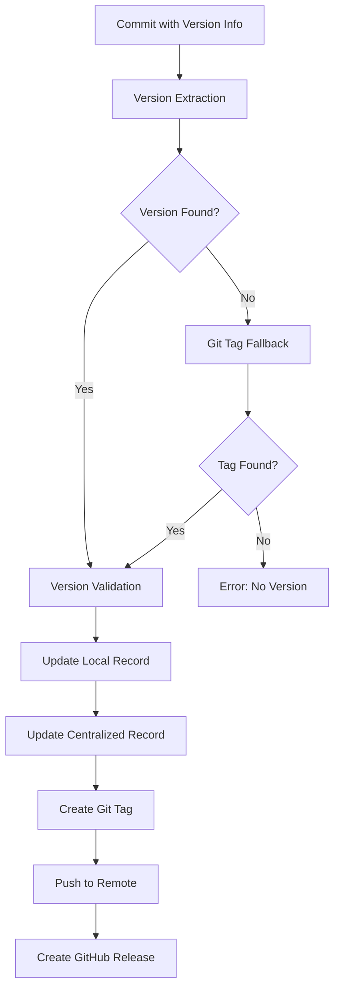

# Version Management in llpkgstore

This document provides comprehensive information about the unified version management system in llpkgstore v2.0+, including version extraction, mapping, recording, and Git tagging.

## 🎯 Overview

llpkgstore v2.0+ introduces a unified version management system that provides consistent behavior across C/C++ and Python packages. This system handles version extraction, mapping, recording, and Git tagging automatically.

## 🔄 Version Management Flow



## 📝 Version Extraction

### Supported Formats

The system supports multiple version formats in commit messages:

#### 1. Package-Specific Format
```bash
git commit -m "Release-as: package_name/vX.X.X"
```

Examples:
```bash
git commit -m "Release-as: numpy/v1.26.4"
git commit -m "Release-as: tabulate/v10.0.0"
git commit -m "Release-as: requests/v2.31.0"
```

#### 2. Generic Release Format
```bash
git commit -m "Release: vX.X.X"
```

Examples:
```bash
git commit -m "Release: v1.0.0"
git commit -m "Release: v2.1.3"
```

#### 3. Version Format
```bash
git commit -m "Version: vX.X.X"
```

Examples:
```bash
git commit -m "Version: v1.0.0"
git commit -m "Version: v2.1.3"
```

### Extraction Priority

The system uses a priority-based approach for version extraction:

1. **Latest Commit Messages** (Priority for CI environments)
   - Scans the last 10 commit messages
   - Skips auto-generated commits (merge, chore, etc.)
   - Extracts version from the first valid commit message

2. **Git Tags** (Fallback mechanism)
   - If no version found in commit messages
   - Uses the latest Git tag as version source
   - Ensures backward compatibility

3. **Error Handling**
   - Clear error messages when no version is found
   - Graceful degradation in non-CI environments

### Version Validation

All extracted versions are validated against semantic versioning standards:

- **Format**: `vX.Y.Z` where X, Y, Z are non-negative integers
- **Examples**: `v1.0.0`, `v2.1.3`, `v10.0.0`
- **Invalid**: `1.0.0`, `v1.0`, `v1.0.0-beta`

## 📊 Version Recording

### Dual Recording System

The system maintains version information in two locations:

#### 1. Local Version Record

**File**: `{package_dir}/llpkgstore.json`

```json
{
  "packages": {
    "tabulate": {
      "versions": [
        {
          "python": "0.9.0",
          "go": ["v8.0.0", "v9.0.0", "v10.0.0"]
        }
      ]
    }
  }
}
```

**Purpose**:
- Package-specific version tracking
- Local development and testing
- Package metadata storage

#### 2. Centralized Version Record

**File**: `llpkg/public/llpkgstore.json`

```json
{
  "packages": {
    "tabulate": {
      "versions": [
        {
          "python": "0.9.0",
          "go": ["v0.0.2", "v10.0.0"]
        }
      ]
    }
  }
}
```

**Purpose**:
- Global version tracking
- Cross-package version management
- Public API for version information

### Version Mapping

The system maps upstream package versions to Go module versions:

- **Python Version**: Original package version (e.g., `0.9.0`)
- **Go Version**: Generated Go module version (e.g., `v10.0.0`)
- **Multiple Mappings**: Support for multiple Go versions per Python version

## 🏷️ Git Tagging

### Automatic Tag Creation

The system automatically creates Git tags based on extracted version information:

#### Tag Creation Process

1. **Duplicate Check**: Verifies if tag already exists
2. **Tag Creation**: Creates annotated tag with descriptive message
3. **Remote Push**: Attempts to push tag to remote repository
4. **Error Handling**: Graceful handling of push failures

#### Tag Format

- **Tag Name**: `vX.Y.Z` (e.g., `v10.0.0`)
- **Tag Message**: `Release vX.Y.Z` (e.g., `Release v10.0.0`)
- **Tag Type**: Annotated tags for better metadata

#### Example Output

```bash
Creating git tag: v10.0.0
Successfully created git tag: v10.0.0
Pushing tag v10.0.0 to remote repository...
Successfully pushed tag v10.0.0 to remote repository
```

### Tag Management

#### Duplicate Prevention

The system checks for existing tags before creation:

```bash
# Check if tag exists
git tag -l v10.0.0

# Skip creation if tag exists
Tag v10.0.0 already exists, skipping creation
```

#### Remote Repository Handling

- **With Remote**: Automatically pushes tags to remote repository
- **Without Remote**: Creates tags locally only
- **Push Failures**: Logs warnings but continues execution

## 🔧 Commands

### Postprocessing Command

The main command for version management:

```bash
llpkgstore postprocessing
```

**What it does**:
1. Extracts version from commit messages or Git tags
2. Updates local `llpkgstore.json` with version mapping
3. Updates centralized `llpkg/public/llpkgstore.json`
4. Creates and pushes Git tags
5. Creates GitHub releases (in CI environment)

**Example Output**:
```
Detected package type: python
Using Python version of llpkgstore command
Starting Python package post-processing...
Extracting version from commit message...
Found version in commit message: Release-as: tabulate/v10.0.0 -> v10.0.0
Updating local llpkgstore.json with version mapping...
Updated llpkgstore.json with package tabulate (Python: 0.9.0 -> Go: v10.0.0)
Updating /path/to/llpkg/public/llpkgstore.json with version mapping...
Updated llpkgstore.json with package tabulate (Python: 0.9.0 -> Go: v10.0.0)
Creating git tag: v10.0.0
Successfully created git tag: v10.0.0
Pushing tag v10.0.0 to remote repository...
Successfully pushed tag v10.0.0 to remote repository
Python package post-processing completed successfully
```

### Release Command

Alternative command for version management:

```bash
llpkgstore release
```

**Features**:
- Same version extraction logic
- Enhanced artifact naming
- Fallback version handling

## 🚀 CI/CD Integration

### GitHub Actions Workflow

The system is optimized for CI environments:

#### Environment Detection

```go
// Check if running in GitHub Actions
if os.Getenv("GITHUB_ACTIONS") != "" {
    // CI-specific behavior
}
```

#### CI-Optimized Version Extraction

- **Priority**: Latest commit messages (suitable for CI)
- **Fallback**: Git tags for local development
- **Error Handling**: Clear error messages for debugging

#### Automated Workflow

1. **Trigger**: Push to main branch or PR merge
2. **Version Extraction**: From commit messages
3. **Version Recording**: Update both local and centralized files
4. **Git Tagging**: Create and push tags
5. **GitHub Release**: Create release with artifacts

### Workflow Example

```yaml
name: post-processing
on:
  push:
    branches: [main]
jobs:
  post-processing:
    runs-on: ubuntu-latest
    steps:
      - uses: actions/checkout@v4
      - name: Run postprocessing
        run: |
          for dir in */; do
            if [ -d "$dir" ] && [ -f "$dir/llpkg.cfg" ]; then
              if grep -q '"type": "python"' "$dir/llpkg.cfg"; then
                cd "$dir"
                llpkgstore postprocessing
                cd ..
              fi
            fi
          done
```

## 🔍 Troubleshooting

### Common Issues

#### 1. No Version Found

**Error**: `no version pattern found in recent commit messages or git tags`

**Solutions**:
- Use proper commit message format: `Release-as: package_name/vX.X.X`
- Ensure version follows semantic versioning: `v1.0.0`
- Check if Git tags exist as fallback

#### 2. Tag Creation Failed

**Error**: `failed to create git tag`

**Solutions**:
- Check Git repository status
- Ensure proper Git configuration
- Verify remote repository access

#### 3. File Update Failed

**Error**: `failed to update llpkgstore.json`

**Solutions**:
- Check file permissions
- Ensure directory exists
- Verify JSON file format

### Debug Commands

#### Check Version Extraction

```bash
# Check recent commit messages
git log -10 --pretty=format:%s

# Check Git tags
git tag -l

# Test version extraction
llpkgstore postprocessing
```

#### Verify Version Records

```bash
# Check local version record
cat llpkgstore.json

# Check centralized version record
cat ../public/llpkgstore.json

# Verify Git tags
git tag -l | grep v
```

## 📚 Best Practices

### 1. Commit Message Format

Always use the recommended format:

```bash
git commit -m "Release-as: package_name/vX.X.X"
```

### 2. Version Numbering

Follow semantic versioning:

- **Major**: Breaking changes (`v2.0.0`)
- **Minor**: New features (`v1.1.0`)
- **Patch**: Bug fixes (`v1.0.1`)

### 3. CI/CD Integration

- Use proper branch protection
- Ensure proper Git configuration
- Test version extraction locally

### 4. Version Record Management

- Regularly check version records
- Monitor for version conflicts
- Maintain consistent versioning across packages

## 🔮 Future Enhancements

### Planned Features

1. **Version Conflict Detection**: Automatic detection of version conflicts
2. **Version Rollback**: Support for version rollback operations
3. **Version Dependencies**: Track version dependencies between packages
4. **Version Analytics**: Version usage statistics and analytics

### Integration Improvements

1. **Multiple Git Providers**: Support for GitLab, Bitbucket, etc.
2. **Custom Version Formats**: Support for custom version formats
3. **Version Validation Rules**: Configurable version validation rules
4. **Version Notifications**: Notifications for version updates

---

For questions about version management, please open an issue on [GitHub](https://github.com/goplus/llpkgstore/issues) or join our [community discussions](https://github.com/goplus/llpkgstore/discussions).
